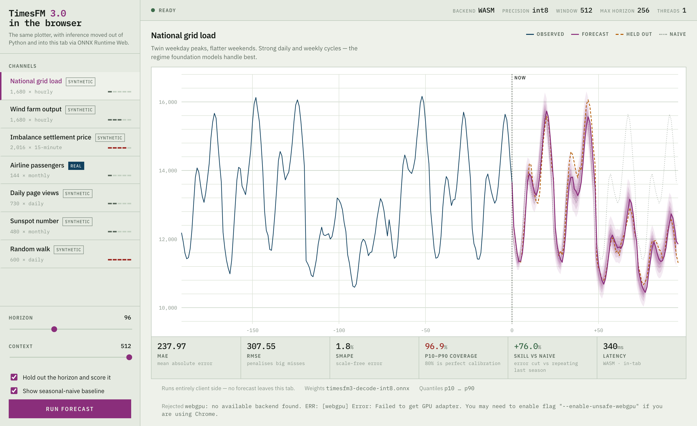

# Running TimesFM 3.0 in the browser

This branch moves inference out of Python and into the browser tab. Same
plotter, same demo channels, no server doing the forecasting.



**Live:** <https://timesfm-plotter.pages.dev> — hosted free on Cloudflare Pages
+ R2, see [DEPLOY.md](DEPLOY.md).

## First, the thing that does not work

**Transformers.js cannot run TimesFM.** It has no TimesFM architecture — its
model list covers PatchTST and PatchTSMixer for time series, and nothing in
`onnx-community/` ships TimesFM. `pipeline()` and `AutoModel` have nothing to
load. The community ONNX exports on the Hub are frozen at a single shape
(`c128-h64`) and have no verifiable provenance.

So this uses **ONNX Runtime Web**, which is what Transformers.js runs on
underneath, with a graph exported here from the official Google checkpoint.
Same destination, one layer lower.

## Quick start

```bash
pip install -r requirements-export.txt
python scripts/export_onnx.py --out web/models --quantize int8
./scripts/fetch_runtime.sh
uvicorn server:app --port 8077
```

Then open <http://localhost:8077/web/browser.html>. Any static file server works
— the page never calls the backend, so `python -m http.server` from `web/` is
equally fine.

The export takes a few minutes and writes about 1.7 GB into `web/models/`.
`fetch_runtime.sh` vendors ONNX Runtime Web into `web/vendor/` (~29 MB) so the
page loads no CDN at all — a demo about local inference should not need the
network to start. Both directories are gitignored.

## How the graph is shaped, and why

`TimesFM3Torch.decode` is a single non-autoregressive pass: context in, the
whole horizon out. That is the part worth exporting. Three things had to change
to get it through the exporter, each verified rather than assumed.

**`cumprod` does not exist in ONNX.** Not at any opset. TimesFM only ever calls
it on boolean patch masks, and for a binary tensor the running product is 1
exactly while no zero has been seen, so `cumprod(x) == (cumsum(x == 0) == 0)`.
Exact substitution, not an approximation.

**`RMSNorm` only reached ONNX in opset 23**, newer than browser runtimes
reliably support. All 200 layers are rebuilt from Mul/ReduceMean/Rsqrt. Measured
output drift after the swap: exactly zero.

**The context length cannot be a dynamic axis.** `decode` computes its patch
indices with Python integer arithmetic —
`num_context_patches = context // input_patch_len` — and those indices become
constants when tracing. A graph exported with a dynamic context axis works only
at the length it was traced at, and silently gathers out of bounds elsewhere.

Rather than rewrite the reference implementation, the graph takes a fixed
512-point window plus the model's own `mask` input. Shorter series are
left-padded and masked off. This is what the mask is for, and it holds up:

| Real context | Deviation vs a natively-sized call |
| --: | --: |
| 64 | 0.12% |
| 128 | 0.12% |
| 256 | 0.02% |
| 512 | exact |

Output is also **bit-identical regardless of what the padding is filled with**
(0, 10 000, or −50), which is the real proof the mask works.

The horizon is fixed at export too, and truncated client-side. Asking for 256
and using 96 costs about 0.2% against a natively-sized call.

## Quantization: where the accuracy actually went

fp32 is 1.32 GB — too much to ship to a browser. int8 gets it to 336 MB, but
naive dynamic quantization is destructive, and not where you would expect.

Point accuracy degrades noticeably. Interval calibration *collapses*:

| | grid-load sMAPE | p10–p90 coverage |
| --- | --: | --: |
| fp32 | 1.9% | 92% |
| int8, all nodes | 3.1% | **30%** |
| int8, output head kept in fp32 | **1.8%** | **95%** |

Coverage of 30% against a target of 80% means the model became wildly
overconfident — the fan looked tight and was wrong. The quantile spread is
produced almost entirely in the output head, so keeping its four MatMul nodes
in fp32 restores it completely. That costs 17 MB.

fp16 was tried and abandoned: `onnxconverter-common` produces a type-inconsistent
graph on this dynamo export, and every op added to the block list just moves the
mismatch to the next one. int8-with-fp32-head lands in the same accuracy
territory at half the size, so it was not worth chasing.

## WebGPU is detected and rejected

ONNX Runtime Web 1.29.0 compiles this graph for WebGPU and then emits invalid
WGSL for `Concat`:

```
error: no matching constructor for 'i32(vec4<u32>)'
    index += i32(uniforms.input_dims[input_dim_idx]);
```

The session is created without complaint and returns NaN. Because it fails at
inference rather than at creation, checking whether the session builds is not
enough — the page runs a probe forecast and verifies the output is finite and
non-constant before accepting a backend, then falls back to WASM and says so in
the footer. If a later runtime fixes the shader, WebGPU gets picked up
automatically with no code change.

## What it costs

Measured on an M4 Pro with `scripts/benchmark.py`, horizon 96, median of 7 runs.
The ONNX exports use a fixed window, so **a short series still pays for the
whole window** — that is the main thing to know before picking one.

| Setup | Window | Latency |
| --- | --: | --: |
| ONNX int8 · CPU (Python) | 512 | 21 ms |
| ONNX fp32 · CPU (Python) | 512 | 22 ms |
| PyTorch fp32 · MPS | — | 40 ms |
| PyTorch fp32 · CPU | — | 63 ms |
| ONNX int8 · CPU (Python) | 4096 | 85 ms |
| PyTorch fp32 · MPS, 4096 ctx | — | 103 ms |
| PyTorch fp32 · CPU, 4096 ctx | — | 139 ms |
| **Browser · WASM int8** | **512** | **336 ms** |
| **Browser · WASM int8** | **4096** | **1757 ms** |

Two things stand out. ONNX on CPU is about 3× faster than the PyTorch path it
replaces (21 ms vs 63 ms), so the export is not the bottleneck — the browser is,
costing roughly 16× the same graph run natively, single-threaded.

## Choosing a window

`--window` is the real decision. Both exports hold the same 330.7M parameters
and differ only in how much context the graph can accept.

| | `--window 512` | `--window 4096` |
| --- | --: | --: |
| Weights | 353 MB | 366 MB |
| Latency in-tab | 336 ms | 1757 ms |
| grid-load sMAPE | 1.83% | **1.71%** |
| p10–p90 coverage | 97% | 95% |
| Skill vs naive | +76.0% | **+78.2%** |

The larger window buys a real but small accuracy gain for 5.2× the latency, and
you pay that latency on every forecast whether or not the series has the history
to fill it. 512 is the better default; reach for 4096 when the extra context
genuinely exists.

Worth being precise about that gain: grid-load only carries 1,584 points of
usable history, so a 4096 window is mostly padding even at its best. The
improvement came from raising context 512 → 1,584, not from reaching 4096. None
of the bundled channels are long enough to fill the window.

```bash
python scripts/export_onnx.py --out web/models-4096 --window 4096 --quantize int8
```

Then load it with `browser.html?models=models-4096`. The page reads the window
from the export's `config.json` and adjusts its context slider to match.

## Limitations

- Context is capped at the export window (512 by default, see above); the
  Python version handles 15,360.
- Horizon is capped at the 256-step export.
- Univariate only, no covariates.
- The first forecast at a new horizon is slower while ORT specialises the graph.
- `ort.env.wasm.wasmPaths` must be an absolute URL. ONNX Runtime `import()`s its
  `.mjs` helper, and a bare relative path like `"vendor/"` is not a valid module
  specifier — it fails only at session creation, well after the page looks fine.
