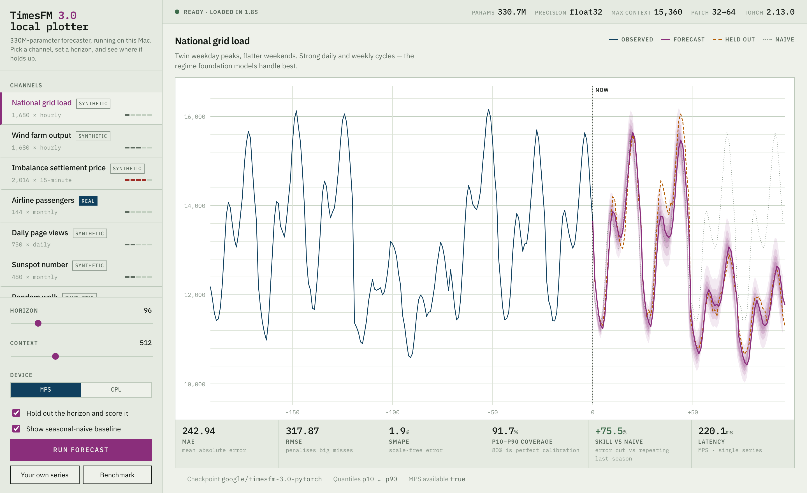

# TimesFM 3.0 — local plotter

A single-page playground for [TimesFM 3.0](https://huggingface.co/google/timesfm-3.0-pytorch),
Google's 330M-parameter time-series foundation model, running entirely on an Apple Silicon Mac.

Pick a series, set a forecast horizon, and the model predicts it. Hold-out scoring is on by
default, so every forecast is graded against the truth it never saw — and against a
seasonal-naive baseline, which is the only comparison that tells you whether the model is
earning its keep.



> **Running it in the browser instead?** The `browser-inference` branch exports
> the model to ONNX and runs it client-side with ONNX Runtime Web — no Python at
> inference time. Live at <https://timesfm-plotter.pages.dev>. See
> [BROWSER.md](BROWSER.md) for how the export works and why Transformers.js
> cannot do this, and [DEPLOY.md](DEPLOY.md) for hosting it free on Cloudflare.

## Why this exists

TimesFM is small enough to run locally, but "it runs" and "it's any good" are different
questions. This answers the second one: it puts the forecast, the p10–p90 uncertainty fan,
the held-out truth, and a naive baseline on the same axes, and scores all of it.

The demo channels are deliberately graded from trivial to impossible — including a pure random
walk, where the correct answer is to predict nothing and say so.

## Requirements

- Apple Silicon Mac (works on Intel and CUDA too; the MPS device toggle just won't apply)
- Python 3.10+
- ~1.5 GB of disk for the checkpoint, downloaded from Hugging Face on first run

## Quick start

```bash
python3 -m venv .venv && source .venv/bin/activate
pip install -r requirements.txt
uvicorn server:app --port 8077
```

Open <http://localhost:8077>. The checkpoint downloads once (a few minutes), then loads in
about two seconds on later runs. The status lamp in the header tells you where it is.

## The channels

Seven series, one real and six synthetic. Synthetic ones are generated from fixed seeds, so
the numbers below reproduce exactly. Everything is labelled in the UI — nothing synthetic is
presented as real data.

Measured on an M4 Pro, context 512, hold-out scoring on:

| Channel | Cadence | Horizon | sMAPE | p10–p90 coverage | Skill vs naive |
| --- | --- | --: | --: | --: | --: |
| National grid load | hourly | 96 | 1.9% | 92% | +76% |
| Wind farm output | hourly | 96 | 168.9% | 79% | +1% |
| Imbalance settlement price | 15-minute | 96 | 189.5% | 79% | +44% |
| Airline passengers *(real)* | monthly | 48 | 5.1% | 75% | +74% |
| Daily page views | daily | 96 | 8.7% | 99% | +29% |
| Sunspot number | monthly | 96 | 13.2% | 93% | +10% |
| Random walk | daily | 96 | 9.3% | 42% | −47% |

Read that table as a map of where the model helps:

- **Strong, stable seasonality is where it shines.** Grid load and airline passengers both land
  around +75% skill — the model cuts naive error by three quarters.
- **sMAPE lies when the series touches zero.** Wind output hits exactly 0 MW whenever the wind
  drops below cut-in, which sends sMAPE to 169% while the forecast is still reasonable. Use MAE
  there.
- **Beating naive is not guaranteed.** Wind managed +1% over 96 hours — no better than
  persistence, which is the honest result for weather-driven generation at that range.
- **On a random walk it does worse than naive (−47%), and its intervals are too narrow**
  (42% coverage where 80% is correct). There is no signal to find, and the model does not
  fully admit it. This is the most useful channel in the set.

You can also paste your own series — one number per line, at least 40 points.

## What the scores mean

| Metric | Reading |
| --- | --- |
| MAE / RMSE | Average error in the series' own units. RMSE punishes large misses harder. |
| sMAPE | Scale-free percentage error. Unreliable near zero. |
| p10–p90 coverage | Share of actuals inside the 80% band. **80% is perfect**; lower means overconfident, higher means the fan is too wide. |
| Skill vs naive | Error cut against repeating the last full season (or the last value, for aperiodic series). **Below zero means the model lost to a one-line baseline.** |

## Speed

Median of three runs, forecasting 128 steps with quantiles, on an M4 Pro:

| Context | MPS | CPU |
| --: | --: | --: |
| 128 | 51 ms | 78 ms |
| 512 | 59 ms | 81 ms |
| 2,048 | 78 ms | 142 ms |
| 8,192 | 183 ms | 221 ms |

MPS wins throughout, but modestly — roughly 1.2–1.8×. At 330M parameters in fp32 the model is
small enough that CPU inference stays perfectly usable, and memory is never the constraint. The
**Benchmark** button in the UI reruns this on your own machine.

## HTTP API

The frontend is just a client; the endpoints are usable on their own.

| Endpoint | Purpose |
| --- | --- |
| `GET /api/meta` | Load status, device, parameter count, quantile levels, max context |
| `GET /api/datasets` | Channel catalogue |
| `GET /api/series/{id}` | One series with its values |
| `POST /api/forecast` | Forecast a channel or your own values |
| `POST /api/benchmark` | Latency sweep across context lengths |

```bash
curl -s localhost:8077/api/forecast \
  -H 'Content-Type: application/json' \
  -d '{"series_id":"grid-load","horizon":96,"context":512,"backtest":true}'
```

Returns the context, the median forecast, all nine deciles (p10–p90), the held-out actuals, the
seasonal-naive baseline, the scores, and the inference time in milliseconds.

Forecasting your own numbers instead:

```bash
curl -s localhost:8077/api/forecast \
  -H 'Content-Type: application/json' \
  -d '{"values":[1,2,3,4,5,6,7,8],"horizon":4,"context":8,"backtest":false}'
```

### Configuration

| Variable | Default | Purpose |
| --- | --- | --- |
| `TIMESFM_DEVICE` | `mps` | Device preloaded at startup (`mps`, `cpu`, `cuda`) |
| `TIMESFM_CHECKPOINT` | `google/timesfm-3.0-pytorch` | Hugging Face repo or local directory |

## Licensing

Two licences apply, and they are not the same.

- **This code** is MIT — see [LICENSE](LICENSE).
- **The TimesFM 3.0 weights** are released under the
  [TimesFM non-commercial licence v1.0](https://huggingface.co/google/timesfm-3.0-pytorch),
  not an open-source licence. Fine for evaluation and research; check the terms before putting
  it near anything commercial.

The airline passenger series is the Box & Jenkins dataset (1949–1960), long in the public
domain. Every other channel is synthetic and marked as such.

## Notes and limits

- Quantiles are the nine deciles the model emits directly. No conformal calibration is applied,
  which is why coverage drifts from 80% on several channels.
- Univariate only. TimesFM 3.0 accepts covariates; this playground does not pass any.
- Forecasts run under a lock, so concurrent requests queue rather than racing the model.
- Long horizons are produced by autoregressive rollout of a 64-step output patch. Quality decays
  with distance, which the widening fan is meant to show.
